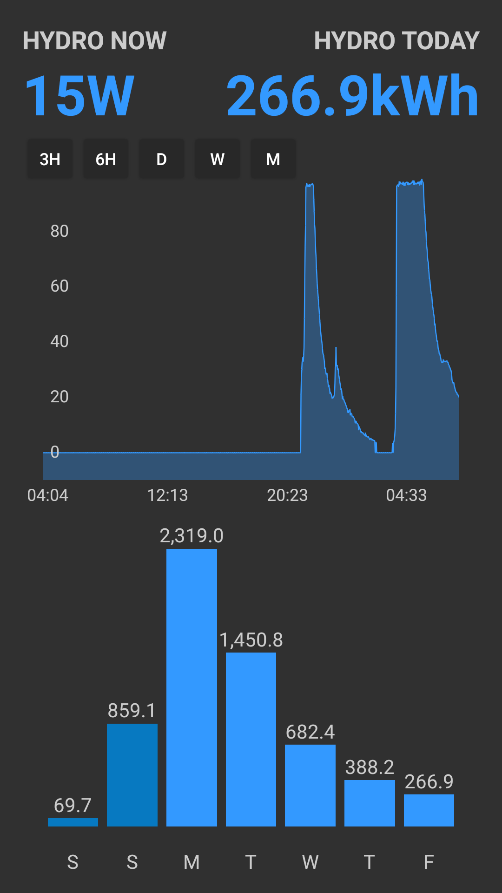

# Cyd Ynni Hydro Android App

Real-time hydro generation output from Cyd Ynni hydro in North Wales, UK

Cyd Ynni : Ynni Lleol is a community project linking up households with local community hydro power projects. Working together, we can help you benefit from cheaper electricity (a potential saving of 10-30%) and support your local renewable energy generators. We have 100 households to be part of our first trial in Bethesa, North Wales UK. 

http://www.energylocal.co.uk/cydynni/

***

Powered by Emoncms open-source energy visualisation. Developed by Megni as part of the OpenEnergyMonitor project; a project to develop open-source energy monitoring tools to help us relate to our use of energy, our energy systems and the challenge of sustainable energy.

- https://emoncms.org/
- https://megni.co.uk/
- https://openenergymonitor.org 

This app is fully open-source and based on the Emoncms Android app:

- Cyd Ynni Hydro source code: https://github.com/glynhudson/AndroidApp
- Emoncms App source code: https://github.com/emoncms/AndroidApp

For support or to get involved with development please post on the forum thread: [https://community.openenergymonitor.org/](https://community.openenergymonitor.org/)

